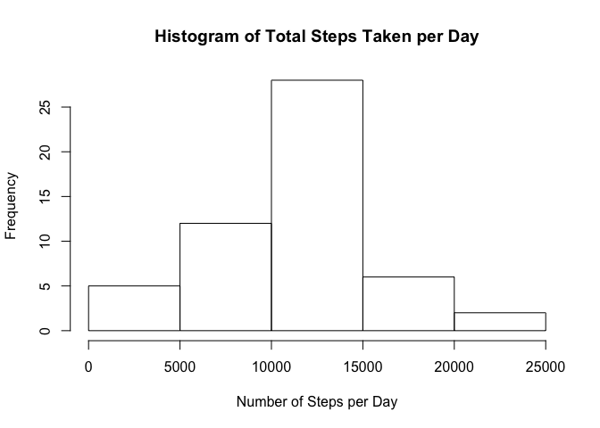
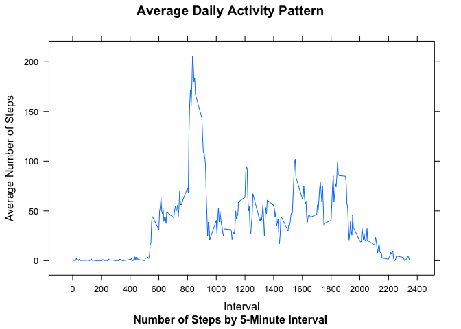
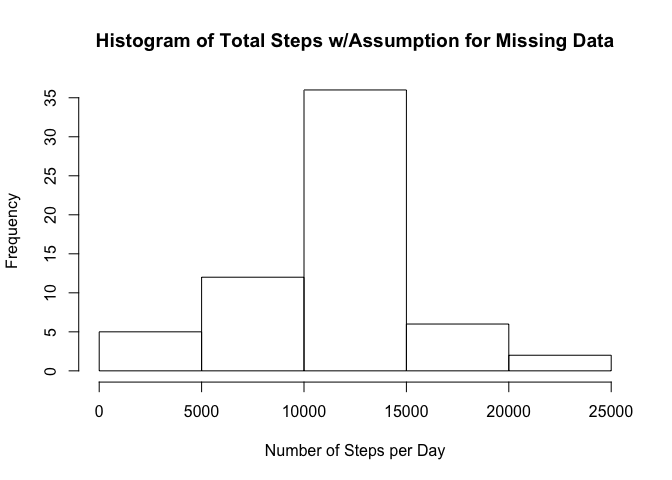
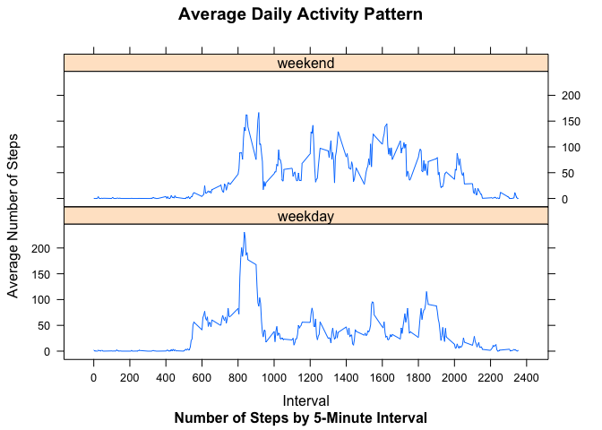

# Reproducible Research: Peer Assessment 1
ktrebach  

## Loading and preprocessing the data

Read the Activity monitoring dataset which is assumed to be in the working 
directory.  
The data consists of three variables:  
1. Date  
2. Interval  
3. Steps  

There are 17,568 observations which correspond to the number of *steps* taken in
each of the five minute *intervals* from the 61 *days between 10/1/2012 and 11/30/2012*.


```r
## Unzip if necesary, read table into R
if(!file.exists("activity.csv")) {unzip("activity.zip")}

stepData <- read.csv("activity.csv", stringsAsFactors = FALSE)

## Count NA values
NAcount<-format(sum(is.na(stepData)), big.mark = ",")

IncompleteCases <- sum(!complete.cases(stepData))

PctIC<-IncompleteCases/nrow(stepData)
```

After some preliminary viewing of the data, it is determined that 2,304 of the step
observations are NA.  

Completion of the data analysis assignment requires a conversion
of the date variable into a POSIXlt date variable.


```r
## Convert dates to POSIXlt
dateN <- as.POSIXlt(stepData$date)

stepData <- cbind(stepData, dateN)

stepData <- select(stepData, dateN, interval, steps)
```

## What is mean total number of steps taken per day?

To calculate the mean of the total number of steps taken each day, we first create 
a dataframe of total number of steps taken per day and then take the mean of that 
total. It is noted that any day that has one or more intervals with NA steps will 
not be considered in the histogram, mean or median.  


```r
## Aggregate the number of steps by day. Only days without any NA steps will be aggregated.
meanstepsbyday <- aggregate(stepData[,3], by = list(dateN = as.factor(stepData$dateN)), 
                            FUN = sum)

## Find the mean and the median. 
meansteps <- format(round(mean(meanstepsbyday$x, na.rm = TRUE),0), big.mark = ",")

mediansteps <- format(round(median(meanstepsbyday$x, na.rm = TRUE),0), big.mark = ",")

## Plot the histogram
hist(meanstepsbyday$x, main="Histogram of Total Steps Taken per Day", xlab = "Number of Steps per Day")
```

 

The mean of the total number of steps taken per day is 10,766 and the median is 10,765.  

## What is the average daily activity pattern?

Here we are trying to find the average number of steps taken during each of the 5 
minute intervals across the observation dates. We create a dataframe of average number
of steps taken by the 5 minute interval.


```r
## Make interval a factor
stepData$interval <- as.factor(stepData$interval)

## Average the number of steps by interval
byinterval <- aggregate(stepData[,3], by = list(interval = stepData$interval), 
                            FUN = mean, na.rm=TRUE)

maxsteps <- round(max(byinterval$x), 0)

rownumb<-which(byinterval$x == max(byinterval$x))

maxinterval <- as.numeric(as.character(byinterval$interval[rownumb]))

## Create the plot
xyplot(x ~ as.numeric(as.character(interval)), data = byinterval, type="l", 
       ylab = "Average Number of Steps", 
       xlab = "Interval", main = "Average Daily Activity Pattern", 
       sub = "Number of Steps by 5-Minute Interval", 
       scales = list(x = list(tick.number = 12)))
```

 

On average across all the days in the dataset, the 835 5-minute interval
contains the maximum number of steps. The maximum number of steps during the
835 interval is 206.

## Imputing missing values

Given that there are a number of days/intervals where there are missing values 
(coded as NA). The presence of missing days may introduce bias into some 
calculations or summaries of the data.

In fact, the total number of rows with missing values in the data set is 
2,304, or 13.11% of the observations.


In order to evaluate the impact of missing data, a new dataset will be created
that fills in the missing step values for a given interval in the dataset with 
the mean for its 5-minute interval.


```r
## Split the dataframe into complete cases and incomplete cases:
stepCompleteT <- stepData[complete.cases(stepData),]  

stepCompleteF <- stepData[!complete.cases(stepData),]

## Fill in the missing data with the average by interval using merge 
stepCompleteN <- merge(stepCompleteF, byinterval)

stepCompleteN <- select(stepCompleteN, dateN, interval, steps = x)

## Bind the two dataframes together to get a complete data set without any missing data
stepComplete <- arrange(rbind(stepCompleteT,stepCompleteN), dateN, interval)
```

We will now evaluate the new dataset to determine the mean and median total number 
of steps taken per day and compare how these values differ from the estimates from
the first part of the assignment.


```r
## Aggregate the number of steps by day
meanstepsCbyday <- aggregate(stepComplete[,3], by = list(dateN = as.factor(stepComplete$dateN)), 
                            FUN = sum)

meanstepsC <- format(round(mean(meanstepsCbyday$x, na.rm = TRUE),0), big.mark = ",")

medianstepsC <- format(round(median(meanstepsCbyday$x, na.rm = TRUE),0), big.mark = ",")

compTable <- xtable(matrix(c(meansteps, meanstepsC, mediansteps, medianstepsC), byrow = TRUE, 2, 2, 
                    dimnames = list(c("  Mean  ","  Median  "),c("  Original  ","  Modified  "))))

## Plot the histogram
hist(meanstepsCbyday$x, main="Histogram of Total Steps w/Assumption for Missing Data",
     xlab = "Number of Steps per Day")
```

 

The mean and median for the modified dataset -- for which all NA values are replaced 
with the average for respective interval -- are shown in the the table below.  The 
mean and median for the original dataset -- for which all NA values are ignored and 
thus any days with NA for any interval are also ignored -- are also shown in the table.  


```r
print(compTable, type = "html")
```

<!-- html table generated in R 3.1.1 by xtable 1.7-4 package -->
<!-- Sun Feb  8 15:12:28 2015 -->
<table border=1>
<tr> <th>  </th> <th>   Original   </th> <th>   Modified   </th>  </tr>
  <tr> <td align="right">   Mean   </td> <td> 10,766 </td> <td> 10,766 </td> </tr>
  <tr> <td align="right">   Median   </td> <td> 10,765 </td> <td> 10,766 </td> </tr>
   </table>


  

While the center of the *modified* data's histogram is taller than the *original* 
data's as it tallies more *complete* days, there is no impact on the daily mean or daily 
median when filling in the missing step values using the interval's average in the 
dataset.  Why?  Because exactly eight values from each interval are missing.


## Are there differences in activity patterns between weekdays and weekends?

We will now compare the average daily activity pattern for weekdays and weekend days.


```r
## Create a factor variable to identify weekend or weekday and bind it to the dataframe.
Dayname <- weekdays(stepComplete$dateN)

for(i in 1:length(Dayname)) {
      if(Dayname[i]=="Saturday"|Dayname[i]=="Sunday") {
            Dayname[i] <- "weekend"
      }else{
            Dayname[i] <- "weekday"
      }
}

Dayname <- factor(Dayname)

stepComplete <- cbind(stepComplete, Dayname)
```


```r
## Average the number of steps by weekend/weekday and by interval
byintervalDN <- aggregate(stepComplete[,3], by = list(interval = stepComplete$interval, 
                        Dayname = stepComplete$Dayname), 
                            FUN = mean)

## Create the panel plot.
xyplot(x ~ as.numeric(as.character(interval))|Dayname, layout = c(1,2), data = byintervalDN, 
       type="l", ylab = "Average Number of Steps", 
       xlab = "Interval", main = "Average Daily Activity Pattern", 
       sub = "Number of Steps by 5-Minute Interval", 
       scales = list(x = list(tick.number = 12)))
```

 

  

As the chart above shows, during the *weekday* there is a peak of activity in the
morning most likely as a result of people commuting to work or school.  The average
daily activity pattern on the *weekend* is shifted slightly later in the day with
the peak activity time not as pronounced and more spread out during the day.

